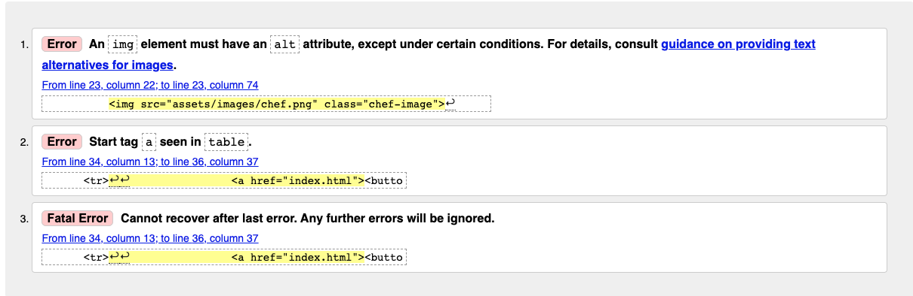
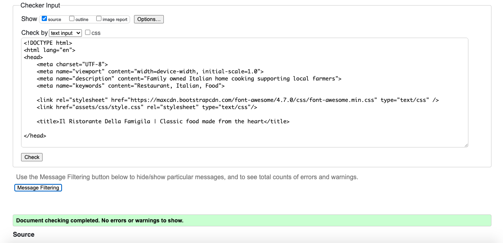

# Il Ristorante Della Famiglia

------

Il Ristorante Della Famiglia is a website for a Restaurant in London England that is designed to raise awareness to people visiting the area in which the restaurant is located, and to also raise awareness in the local area to people who do not know about the restaurants existence already. The websites goals for potential customers are: to provide the potential customer with a general rundown of information they may need before entering the restaurant, such as; events happening soon, what’s on the menu, where on a map the restaurant is located and even some history and a general background about the restaurant, such as; where the produce is sourced, what effort the restaurant is going-to to be ethical, sustainable and how they cut down on wastage. The customer should also be able to find an easy to use and access booking section which will make it easier and hassle free to reserve a table.

------
## User requirements

The requirements for the website by the restaurant owners are for the website to present the restaurant as a high quality, professional place that appeals to all types of people; restaurant critics, restaurant owners, families and also people that just want to have a quick meal and leave. 

The website should be easy to use and easily accessible for all types of people so that the website reflects the restaurant as an appealing and inclusive place. 

Finally, the restaurant should display all the information a customer may need, meaning when they arrive at the restaurant they’re fully informed and familiar with the restaurant and shouldn’t need to ask any questions to the waiter/waitress.

------

-------

------

## Features

### Features found on all pages

On all of the pages you will find a fully responsive nav bar that consists of 4 navigation options; Home, Bookings, Menu and also Our Story. I have put the navigation buttons in this order because i beleive this is the order of most importance which will help the user intuitively want to move from one to the next with the least ammount of movement nessecary.

On all of the pages you will also find a banner consisting of the company logo and also the italian flag at the top and the bottom, This design is to help the user identify this as an italian restaurant without it being too obvious, such as saying what it is, it also looks professional and consistent helping the user build trust with the business, my final point for this feature is that it also is eye catching and a positive peice of content upon opening the page for the first time.

------

## Home page features

 The content on this page should be a rough overview of everything you may need at first glance, which is why i have put opeing times, where to find us and also a breif introduction on this page.

 The opening times are simple to understand, each day is clearly identified with each opening closing time for each day clearly assigned below. If the opening and closing times change, they will be updated here.

 The what we do section on the home page is designed to advertise in a breif description what the restaurant does is about and will be updated as things change.

 The where to find us section is one of the most important elements of the restaurant, this is because every customer needs to know where the restaurant is loacted in order to eat there, this is why this element is on the front page.

-------
## Menu page features

The menu page contains the restaurant menu, this page is solely dedicated to this because it is a highly important and valued section for all restaurants, it is also important for customers to be able to browse the menu before arriving to ensure that there is something that they want to eat, under each name and description is a price listed, this also helps people decide what they can afford and also helps customers total the cost of the dining experiance. As the menu changes this page will be updated

--------

## Bookings page features

This page features a form element that will allow customers to book a table to ensure they can garuntee a dinning experiance. once filled out, the form will send the booking informaation to the restaurant email adress, which will then be entered into the manual bookings system 

----------

## Our Story

In the Our Story page there are 2 halfs to the page, one half being about the company ethics and the second a historical background on the restaurant and its founders, this is to give some extra detail to customers who may be interested in the family history or even those who are looking to be more ethical and health consious in their eating habbits.

-------

## Testing

During my last mentor meeting i showed of the finished website and was informed that if there were any errors it would be automatically failied, so i went back to the drawing board and so, due to this, i have split the testing into 2 parts, before and after the mentor meeting.

## Before my mentor meeting

### HTML Testing

### HTML errors

Most of the errors that were found on all of the pages were identical, which tells me that the errors are to do with either the banner, navigation or the footer, based off of the errors description it is telling me that the errors are to do with the logo image and the fact i havent put an alternative text there and also to do with the navigation bar, i have enclosed each button in a table element, which is not 

For HTML testing, i used: https://validator.w3.org/
### CSS testing

### CSS errors

The error i found in css testing is that i have written the font-family selection, but not actually identified one in the "head, body and footer" classes

For CSS testing, i used:https://jigsaw.w3.org/css-validator/

------

## After my mentor meeting

### HTML testing

#### Home page 

#### Menu page

#### Bookings page

#### Our story page

As you can see from the screenshots above, i have successfully corrected all the errors i made and have re-tested the pages and it has come back with no errors found

## pages once testing has been completed

For HTML testing, i used: https://validator.w3.org/
## CSS testing

The css had no errors to begin with and so haas not changed

For CSS testing, i used:https://jigsaw.w3.org/css-validator/

------- 

### Deployment

The site was deployed to GitHub pages, here are the steps i took to deploy the site:
1. In the GitHub repository i navigated to the Settings tab
2. then from the source section drop-down menu i selected the Master Branch
3. finally after the master branch was selected, the page automatically refreshed with a detailed ribbon display to indicate the successful deployment.
4. The live link can be found here: https://ollie-judge.github.io/il-ristorante-della-famiglia/

---------

## Credits

For most of the hints and tips i used: https://www.w3schools.com/html/default.asp
For figuring out how to position divs horizontally next to each other i used: https://www.w3docs.com/snippets/css/how-to-align-divs-side-by-side.html
For the Chef image i got it from: https://www.clipartkey.com/view/ixJmJi_transparent-cook-clipart-italian-chef-cartoon-transparent/
For making the text stay on one line when resizing the tab i used: https://stackoverflow.com/questions/41248992/get-button-text-on-to-one-line#41250173
For making a responsive nav bar i used: https://www.modern-css.com/responsive-navbar-with-css-grid.html
For the menu content i got the menu content from: "Jamie Oliver Jamies Italy" cook book